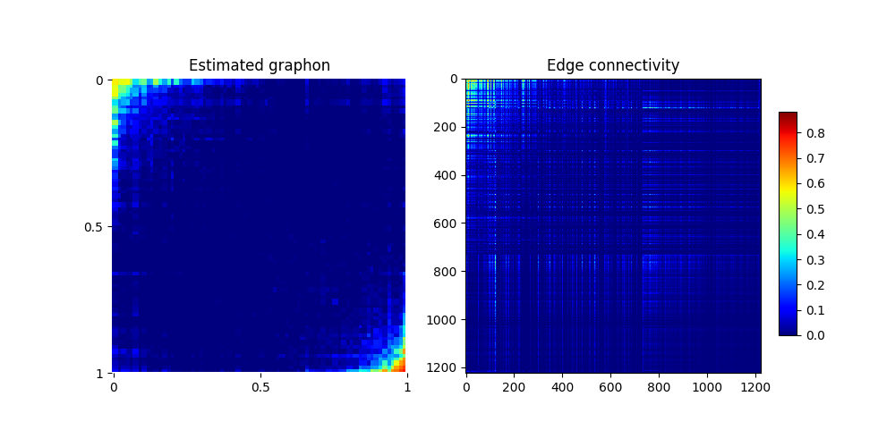

#############################
 First graphon approximation
#############################

**************************
 political weblogs dataset
**************************

We will take a look at the political weblogs dataset :footcite:`adamic2005political` using the network histogram approximation from :cite:t:`olhede2014`.

.. note:: 

   This dataset is available from `the Netzschleuder network catalogue <https://networks.skewed.de/>`_  using `this link <https://networks.skewed.de/net/polblogs/files/polblogs.csv.zip>`_. You can load it manually or by 
   running the following code (you may need to first install the required packages with ``pip install pandas requests networkx zipfile``)

   .. code:: python

      import pandas as pd
      import requests, io, networkx
      from zipfile import ZipFile

      url =  "https://networks.skewed.de/net/polblogs/files/polblogs.csv.zip"
      response = requests.get(url, stream=True)
      with ZipFile(io.BytesIO(response.content)) as myzip:
         with myzip.open(myzip.namelist()[0]) as myfile:
            df = pd.read_csv(myfile)

      df.columns = ["source", "target"]
      A = nx.to_numpy_array(nx.from_pandas_edgelist(df, "source", "target"))

      # we remove the diagonal to avoid self-loops
      A -= np.diag(np.diag(A))
 

We now have the adjacency matrix representing the weblogs with at least one link to another weblog in the dataset. 
Following :cite:t:`olhede2014`, we use a blocks of 72 nodes, which gives us a bandwidth of :math:`h=1/72`. 
We can then estimate the graphon using the following code:

.. code:: python

   from pygraphon.estimators import NetworkHistogramEstimator
   estimator = NetworkHistogramEstimator(bandwithHist = 1/72)
   estimator.fit(A)

which should show something like 

.. code:: console
   
   Log likelihood: -2.6680:   1%|███                 | 5/500 [00:06<10:10,  1.23s/it]

In the paper introducing the method, the authors report a normalized log-likelihood of :math:`-2.8728` for this dataset. Ours is 
slightly better, probably due to the randomness of the optimization procedure.

We can now plot the estimated graphon :math:`\hat{f}:[0,1]^2 \mapsto [0,1]` and the estimated matrix of edge probabilities 
:math:`\hat{P}_{ij} = \hat{f}(\hat{\xi}_i,\hat{\xi}_j)`

.. code:: python

   import matplotlib.pyplot as plt

   graphon = estimator.get_graphon()
   edge_probabilities = estimator.get_edge_connectivity()

   # prepare plot
   fig, ax = plt.subplots(1, 2, figsize=(10, 5))
   fig.subplots_adjust(right=0.9)
   cbar_ax = fig.add_axes([0.95, 0.15, 0.05, 0.7])
   colormap = "jet"

   plot_step_graphon(graphon, fig=fig, ax=ax[0], colormap=colormap)
   im = ax[1].imshow(edge_probabilities, cmap=colormap)
   plt.colorbar(im, cax=cbar_ax)

.. footbibliography::